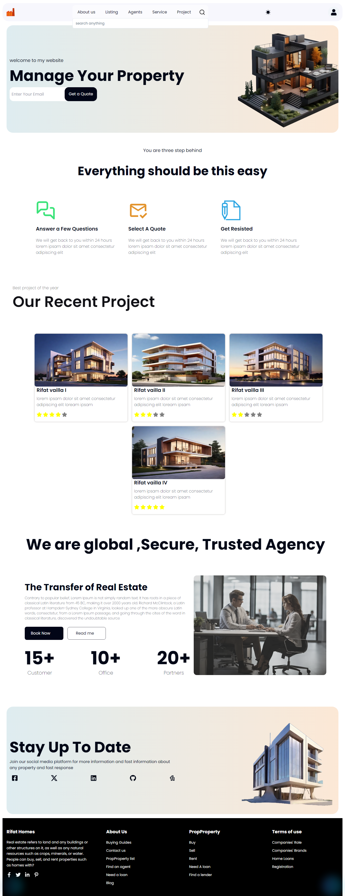
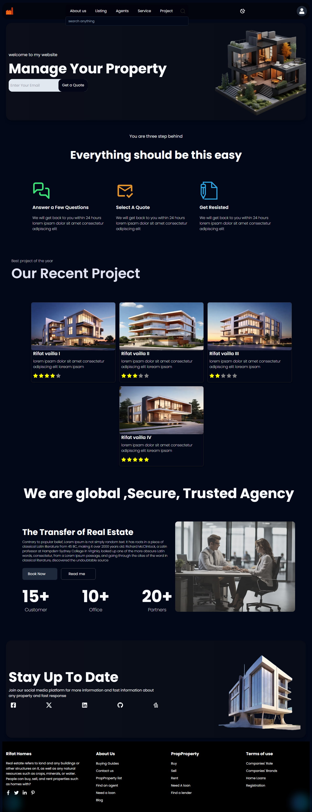
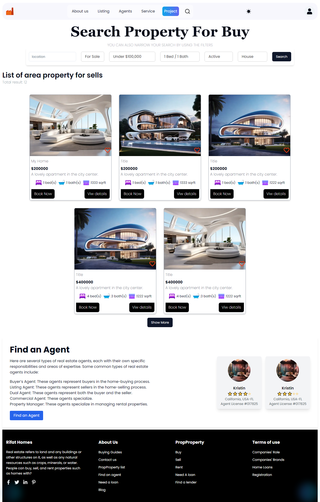

## 🏡 Real Estate Website

Welcome to your fully coded, feature-rich real estate platform! This website offers a seamless experience for users looking to **view**, **buy**, and **filter** properties, complete with smooth animations and a user-friendly interface.

## 🚀 Getting Started

To get your development server up and running, use one of the following commands:

```bash
npm run dev
# or
yarn dev
# or
pnpm dev
# or
bun dev
```


## 🔧 Environment Variables
Make sure to configure your environment variables for the project to run smoothly. The required variables include:
- `MONGO_URI`
- `NEXT_PUBLIC_api_key`
- `NEXT_PUBLIC_CLOUDINARY_CLOUD_NAME`
- `CLOUDINARY_API_SECRET`
- `NEXT_PUBLIC_URL`
- `ACCESS_KEY`
- `REFRESH_KEY`

## ✨ Features

- **Property Viewing**: Explore a wide range of properties with high-quality images and detailed descriptions.
- **Advanced Filtering**: Narrow down your search with powerful filtering options to find your dream property.
- **Buying & Selling**: Easy and secure process to buy or sell properties directly on the platform.
- **Smooth Animations**: Enjoy a polished experience with smooth transitions and animations throughout the site.

## 📷 some ss






## 🔨 Building & Production

Ready to go live? Build and run your project in production with:

```bash
npm run build
npm start


```
# 🤝 Support & Contact

If you enjoyed using this platform or found it helpful, please consider giving it a ⭐! For any questions or project inquiries, feel free to [contact me](https://rifatportfolionextjs.vercel.app/).
